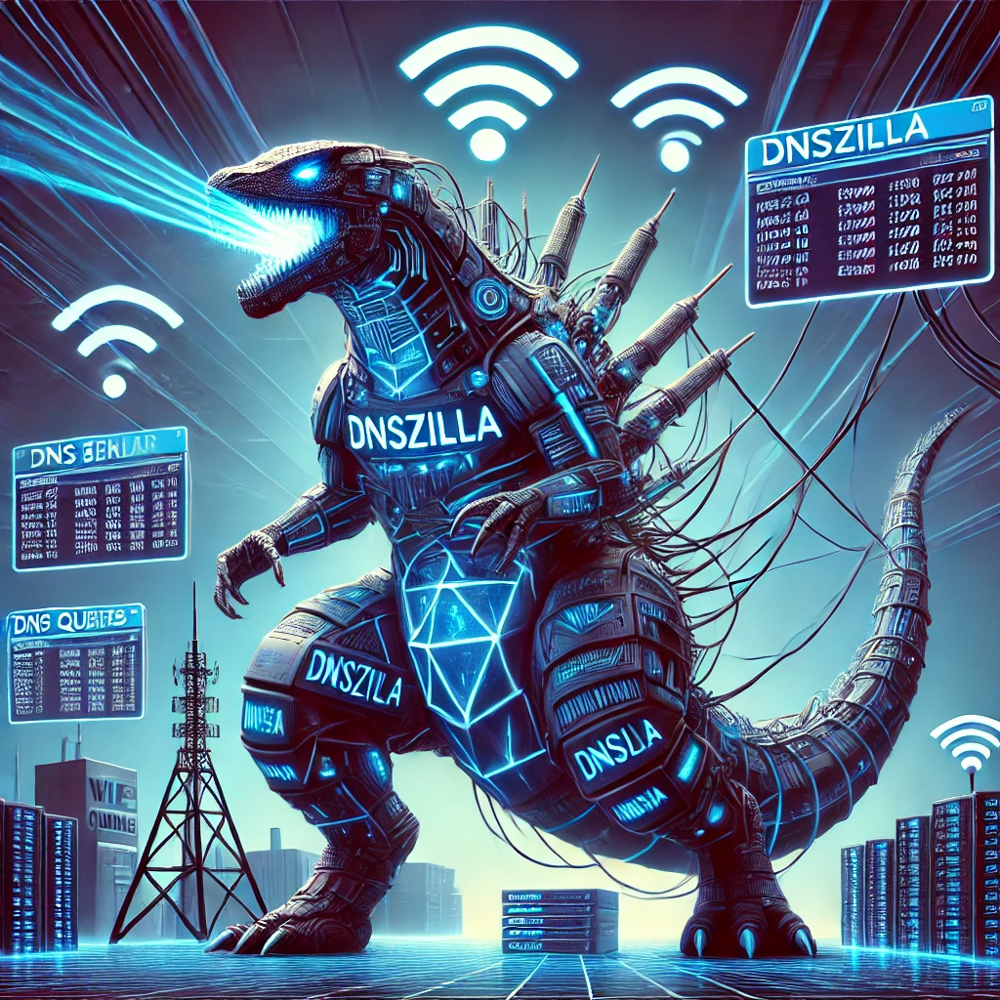

# ------------------------------- VM DSNZILLA --------------------------------

## Relevant links and resources

* [Gérez vos zones DNS avec PowerDNS](https://blog.stephane-robert.info/docs/services/reseau/powerdns/)
* [Pilotez PowerDNS avec PowerDNS-Admin](https://blog.stephane-robert.info/docs/services/reseau/powerdns/powerdns-admin/)
* [Repo powerdns](https://repo.powerdns.com/)
* [Repod powerdns admin](https://github.com/PowerDNS-Admin/PowerDNS-Admin)
